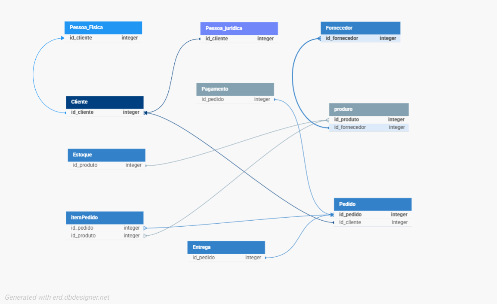
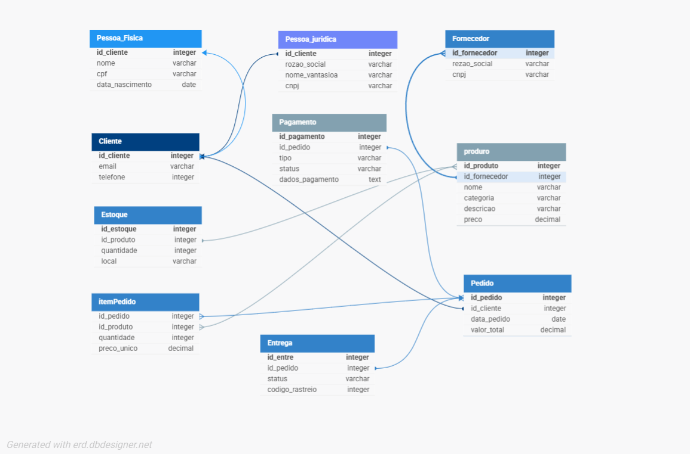

# 📦 Sistema de E-commerce - Modelo de Banco de Dados  

  
  
  

Este repositório contém a **modelagem de um Banco de Dados para E-commerce**, criada com base em boas práticas de normalização e organização de entidades.  
O projeto foi desenvolvido utilizando o site 👉 [dbdesigner.net](https://erd.dbdesigner.net/designer/schema/1755450730-e-commerce).  

---

## 📑 Sumário
- [📖 Sobre o Projeto](#-sobre-o-projeto)
- [🗂️ Modelo Entidade-Relacionamento (MER)](#%EF%B8%8F-modelo-entidade-relacionamento-mer)
- [💳 Tipos de Pagamento](#-tipos-de-pagamento)
- [⚙️ Tecnologias e Ferramentas](#%EF%B8%8F-tecnologias-e-ferramentas)
- [🚀 Roadmap](#-roadmap)
- [🤝 Como Contribuir](#-como-contribuir)
- [📜 Licença](#-licença)

---

## 📖 Sobre o Projeto
O objetivo é **estruturar um banco de dados para E-commerce**, contemplando:  
✔️ Cadastro de clientes (**Pessoa Física e Jurídica**)  
✔️ Controle de fornecedores e produtos  
✔️ Gestão de estoque  
✔️ Registro de pedidos, itens, pagamentos e entregas  
✔️ Suporte a diferentes formas de pagamento e controle de status de entrega  

Esse modelo poderá servir como **base para implementação de sistemas reais** de E-commerce.  

---

## 🗂️ Modelo Entidade-Relacionamento (MER)

📌 **Primeira versão (estrutura inicial):**  

📌 **Segunda versão (com atributos e melhorias):**  

---

## 💳 Tipos de Pagamento  

Nosso modelo contempla múltiplas formas de pagamento, permitindo maior flexibilidade ao cliente:  

- **Pix** ⚡ → Pagamento instantâneo via chave ou QR Code.  
- **Boleto Bancário** 🧾 → Geração de boleto para pagamento em bancos ou apps.  
- **Cartão de Crédito/Débito** 💳 → Pagamento imediato ou parcelado.  
- **Transferência Bancária** 🏦 → TED, DOC ou PIX agendado.  
- **Carteiras Digitais** 📱 → Integração com PayPal, Mercado Pago, Google Pay, etc.  

Cada pagamento possui campos para **status** e **dados adicionais**, permitindo rastreabilidade e controle antifraude.  

---

## ⚙️ Tecnologias e Ferramentas
- [dbdesigner.net](https://dbdesigner.net) → criação do modelo ERD  
- GitHub → versionamento e documentação  

---

## 🚀 Roadmap  

✅ Modelagem inicial MER  
✅ Estrutura de entidades normalizadas  
✅ Relacionamentos com cardinalidade  

🔜 Futuras implementações:  
- [ ] Scripts SQL para criação das tabelas  
- [ ] Inserção de dados de exemplo (mock data)  
- [ ] Stored Procedures para relatórios  
- [ ] Integração com API REST (FastAPI)  
- [ ] Testes automatizados  

---

## 🤝 Como Contribuir  

Quer contribuir? Siga os passos abaixo:  

1. Faça um **fork** do projeto 🍴  
2. Crie uma branch: `git checkout -b minha-feature`  
3. Commit suas mudanças: `git commit -m 'Adicionei uma nova feature'`  
4. Envie para o repositório: `git push origin minha-feature`  
5. Abra um **Pull Request** 🚀  

---

## 📜 Licença
Este projeto está sob a licença **MIT**.  
Sinta-se à vontade para usar, modificar e compartilhar.  

---

✨ Desenvolvido com dedicação para servir como base de **E-commerce profissional** 🚀  
